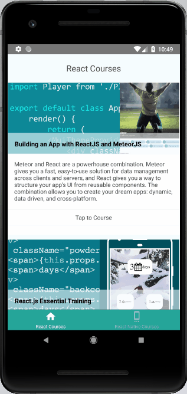

# OnlineCourseApp-ReactNative
This is an Online Course App built with React Native that provides a directory of React courses on Lynda.com



## How to Open
 - Preparing the Android device
    - Using a physical device
If you have a physical Android device, you can use it for development in place of an AVD by plugging it in to your computer using a USB cable and following the instructions [`here`](http://facebook.github.io/react-native/docs/running-on-device).

    - Using a virtual device
If you use Android Studio, open ./OnlineCourseApp-ReactNative/android, and select an emulator to launch. Follow instruction [`here`](http://facebook.github.io/react-native/docs/getting-started#preparing-the-android-device)

 - Running your React Native 
 ```
cd OnlineCourseApp-ReactNativ
npm install
react-native run-android
```

Course:

[From React to React Native--Emmanuel Henri](https://www.lynda.com/React-Native-tutorials/From-React-React-Native/577371-2.html)
